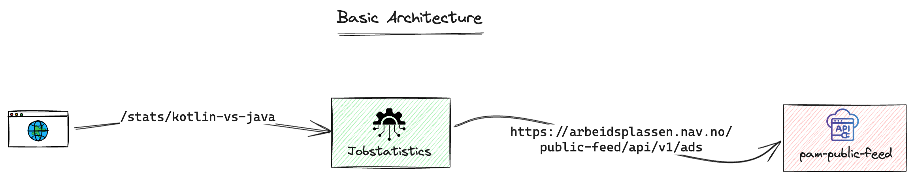
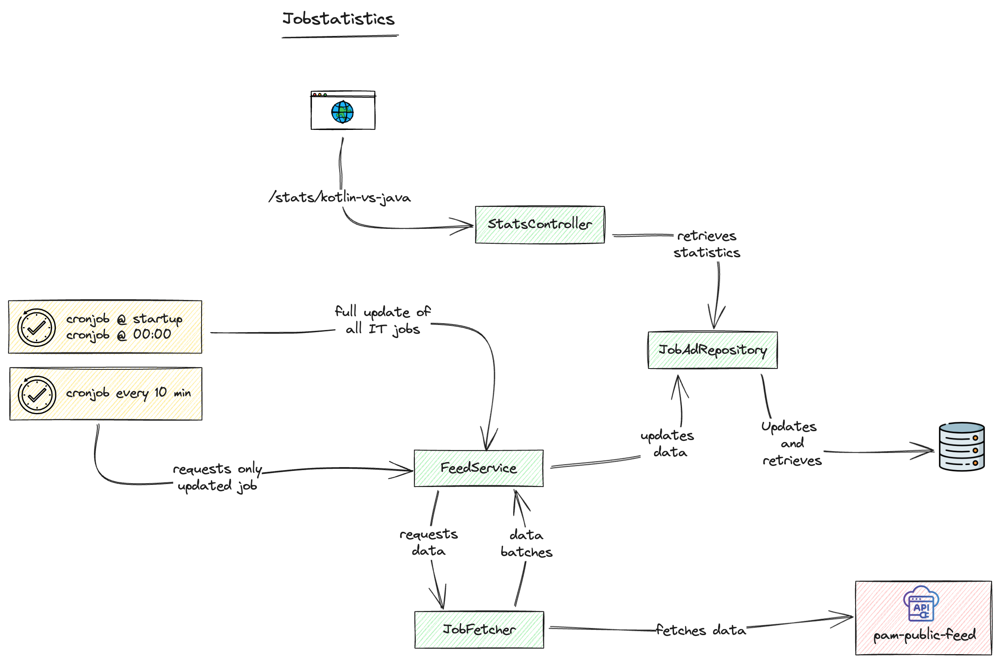

## Job Statistics Service
The purpose of this application is to provide job statistics for Java vs Kotlin positions, updated weekly, over the past 6 months.

This application retrieves its data from the NAV Ads Public API. The API offers published information on available jobs in Norway and details about employers. For more documentation and to obtain the public API key, please visit our GitHub page: PAM Public Feed.

### Technologies
This application is built using Spring Boot and runs on Java 21. It uses maven for dependency management.
It uses a database to store job listings.


### Basic Architecture
The basic architecture of the application is illustrated below:



This diagram illustrates the basic data flow for the job statistics service.

### Data Flow
1.	The client sends a request to the JobStatistics service.
2.	The JobStatistics service fetches job data from the pam-public-feed.
3.	The service processes the data and responds to the client with statistics comparing Kotlin and Java job listings.

### Job Statistics Service Architecture
The architecture of the Job Statistics Service is illustrated below:



#### The Cronjobs
The application includes a cron job that updates the job ads database with the latest listings from the NAV Ads Public API.\
The cron job runs at application startup and once every day at midnight for a full database refresh. Additionally, the cron job runs every 10 minutes to update the database with the most recent job ads.

#### The Rest API
The application also provides a REST API that delivers job statistics comparing Java and Kotlin positions over the past 6 months.


### Getting Started
The repository includes a Docker Compose file that can be used to build and run a Docker image for the PostgreSQL database.

To build and start the database container, run the following command in the root directory of the repository:
```shell
docker-compose up -d
```

To run the application locally, execute the following command in the root directory of the repository:
```shell
mvn spring-boot:run
```

The application will update the database with IT job ads from the past 6 months upon startup.

### API Endpoints

The application will be available at http://localhost:8080.

Use the following endpoint to retrieve the job statistics:

http://localhost:8080/stats/kotlin-vs-java


